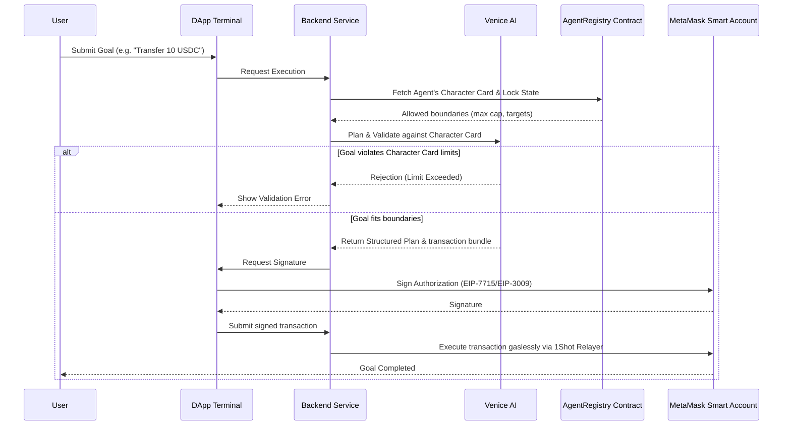

# Architecture & Planning

This section covers the technical architecture, execution flows, and the Venice AI reasoning engine that powers Synapse.

---

## Technical Workflow

When a user submits a goal (e.g., *"Rebalance my portfolio by moving 20 USDC to the lending pool"*), the system processes it through a multi-stage validation pipeline:

---

## 1. The Validation Pipeline

### Step 1: Registry Lookup
The backend queries the `AgentRegistry` smart contract to retrieve the agent's active configuration snapshot and character card. This ensures that even if the developer updates their off-chain codebase, the on-chain registry remains the single source of truth for the agent's permissions.

### Step 2: Venice AI High-Level Planning
The natural language goal is passed to the **Venice AI Planner** along with the agent's character card.
The planner performs structural checks:
* **Function Analysis**: Maps the goal's intent to allowed actions (e.g., does it require a `transfer` when only `run-inference` is allowed?).
* **Limit Verification**: Calculates the estimated transaction values and checks them against the agent's spending limits.
* **Target Authentication**: Ensures the destination contract matches the whitelisted `targetProtocols` address.

If any check fails, the planner immediately rejects the execution request and surfaces a validation error to the frontend.

### Step 3: Low-Level Transaction Bundling
If the goal fits within the agent's permissions, Venice AI maps the goal to a series of specific, low-level transaction payloads. This payload is bundle-formatted and sent back to the frontend for the user's Smart Account authorization.

---

## 2. LLM Gateway & API Fallback

To support flexible deployments and fallback routes, the LLM reasoning is handled via a unified API gateway in `InferenceService.ts`:

1. **Gemini API (`gemini-1.5-flash`)**: The default primary model. When `GEMINI_API_KEY` is set in the environment variables, it handles both reasoning planning and chat interfaces.
2. **Venice AI API (`llama-3.3-70b`)**: The secondary reasoning engine. Venice AI provides decentralized, privacy-focused open-weight model hosting.
3. **Mock LLM Fallback**: If neither key is provided, the API falls back to structured test responses. This ensures offline development remains fully operational.
